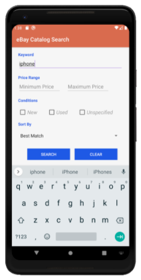
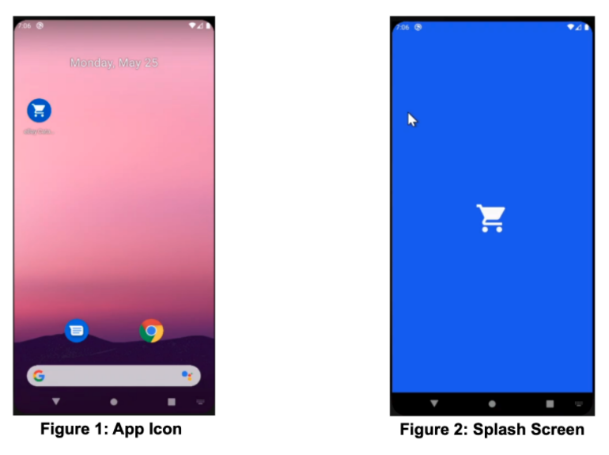
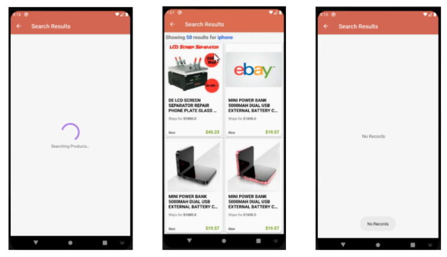
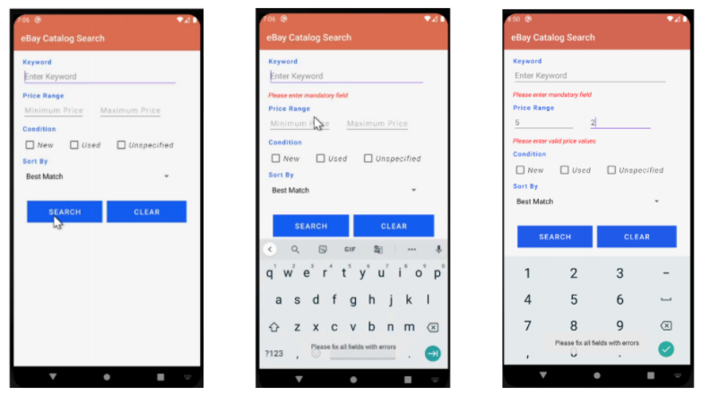
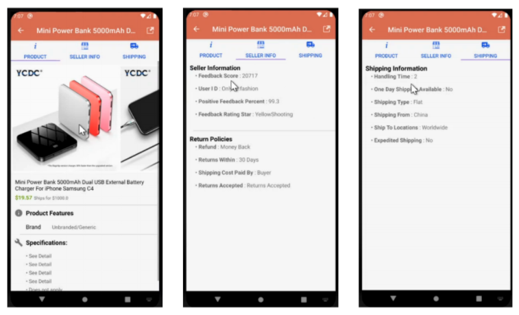

#### Client Side (Android):

1.These are the major activities.

1. It also supports more details, for example, splash screen, refresh, error validation.

------

#### Server Side (NodeJS)

Use NodeJs to receive mobile side's Ajax call and send request to eBay. Get Json data from eBay and response data to front-end to display after processed them in proper way.